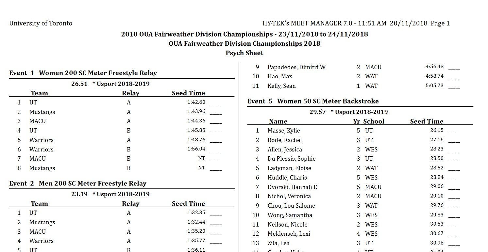

# Swim Result Parser

[](https://travis-ci.org/myh999/swim-result-parser?branch=master)
[](https://coveralls.io/github/myh999/swim-result-parser?branch=main)

This is a continuation of the [Psych Sheet Ranker](https://github.com/myh999/psych-sheet-ranker/), which is a tool that parses psych sheets and uses the rankings to calculate the points the teams would have gained if the rankings remained the same after the swim meet. This iteration now parses the psych sheet into a JSON format, gives more potential for analysis.


Example of a psych sheet

## Prerequisites
This apps requires the following prerequisites:
* Node.js

## Setup

* Install dependencies
```bash
npm install
```

* Build and run the project
```bash
npm run build
npm run serve
```

A demo should then be available on http://localhost:3000/demo for tesing

## Project Structure

| Name | Description |
|-----------|-----------|
| dist | Contains the output of the TypeScript build |
| src/controllers | Controllers that define the functions to HTTP requests |
| src/public | Static assets used in the demo |
| src/types | Commonly used TypeScript interfaces |
| src/server.ts | Express app entry point |
| src/util/logger.ts | Manages the logging of the app |
| src/util/meet-manager.ts | Performs analysis for swim meet data |
| src/util/pdf-parser.ts | Parses psych sheet PDFs into meet data |
| src/util/string-matcher.ts | Provides string matching utilities for parsers
| test | Test files |
| copy-static-assets.ts | Build script that copies static assets to the dist folder |
| analysis | Jest files used for full analysis of psych sheets (alternative to using the demo) |

## Testing
This project uses Jest as the test framework and uses ESLint for linting.  
To test:
```bash
$ npm run test
```

To lint:
```bash
$ npm run lint
```

## Limitations
This parser is optimized for OUA Varsity swim meet psych sheets using the HyTek software to generate psych sheets. Other psych sheets might work, since many of them follow a similar format, but accuracy is not guaranteed. Most notably, age group meets will not work with this parser.

## TODO
* Expand this into other formats, most notably live results (see http://results.rectec.ca/oua20/)
* Improve demo page
* Improve validation for PDF parser test (ex. compare against known # of teams)
* Optimize some inefficient algos
